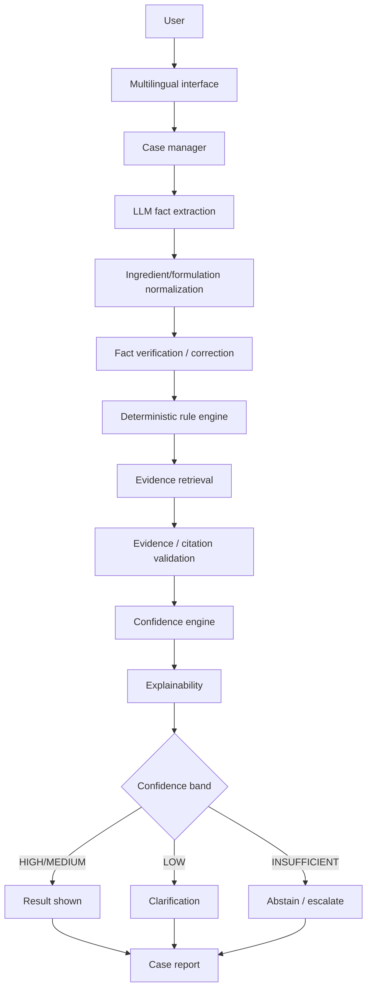

# IP-SAKTI Sahayak — Final Implementation Specification (v4)

**Status:** implementation-ready. This document is the single source of truth for the 7-day build. If something isn't in here, don't build it without updating this document first.

**v4 changelog (targeted additions over v3 — architecture unchanged):** explicit case re-analysis / versioning (§9a, DB schema, demo step 2a); `evidence_id` + `retrieval_timestamp` added to evidence provenance (§6); retrieval evaluated as its own stage before answer-level metrics, with Recall@5, Recall@10, and MRR made explicit (§20); test suite reorganized into unit/integration/e2e with named integration boundaries (§21); two failure-mode red-team cases added — LLM/API failure and retrieval failure (§21, now 12 cases).

---

## MVP priority order

Build in this order. A lower priority never gets started before the priority above it is working.

**Priority 1 — Core working flow (this is the demo, everything else supports it):**
User formulation description → fact extraction → user fact verification/correction → deterministic classification/rule engine → evidence retrieval → citation validation → explainable result.

**Priority 2 — Reliability:**
Temporal/as-of-date reasoning; confidence breakdown; abstention when evidence or facts are insufficient; human escalation.

**Priority 3 — Product usability:**
Case management; case history; report export; India vs international view.

**Priority 4 — Stretch features:**
Hindi/English multilingual flow; Bhashini integration if available; TKDL scoped/mock workflow.

**Stretch features must never block the core MVP.** If Priority 4 work is incomplete or unavailable (e.g. Bhashini access doesn't come through), the system still fully works in English with the TKDL honest-stub message — nothing in Priority 1–3 depends on Priority 4.

**Freeze the architecture:** once Priority 1–3 components are implemented, the architecture is considered frozen for the 7-day prototype. New technologies or major modules should not be added unless an existing requirement cannot be satisfied without them.

---

## What we are not building

For this 7-day prototype, we are explicitly **not** building:

- Full Ayurveda/IP legal coverage
- Complete TKDL database access or scraping
- Large-scale IP India scraping
- Production-grade government authentication
- Production DPDP/security compliance
- Full international legal coverage
- Voice interface
- Production-scale infrastructure
- Complex graph database
- Autonomous AI legal decision-making

If a teammate finds themselves building toward any of the above, stop and check this list first.

---

## 1. Final product definition

**Target users:** AYUSH startups/MSMEs, Ayurvedic practitioners, researchers, and cultivators who need to understand the IP, regulatory, and traditional-knowledge posture of a formulation before they invest in protecting or commercializing it.

**Primary problem:** they can't tell, without expensive legal counsel, whether a formulation is classical (largely unpatentable, TKDL-defended) or has genuine patent potential, what ABS obligations attach to it, or whether TKDL prior art is relevant — and the law itself is a moving target (2024 patent/BD rules, WIPO GRATK Treaty).

**Core workflow:** user describes a formulation → system extracts structured facts → a deterministic rule engine classifies it and identifies applicable provisions → the system retrieves and validates supporting evidence → confidence is scored per claim → the user gets an explainable result, or the system asks for more facts, or it escalates to a human IP facilitator.

**What the prototype actually does:** classifies a formulation into one of a defined set of categories using a deterministic, auditable rule set; shows the exact statute/rule that produced the classification with dated citations; demonstrates temporal reasoning on one real statute with two versions; flags when TKDL relevance exists without pretending to search restricted TKDL data; separates India vs international answer sets; abstains or escalates when evidence or facts are insufficient; persists everything as a reviewable case with an exportable report.

**What it deliberately does NOT do:** give legal advice, cover the full corpus of Ayurveda law, search the actual restricted TKDL database, provide production-grade authentication/compliance, support more than one live non-English language round-trip, or resolve conflicting rules automatically without surfacing the conflict.

**What makes it different from a generic RAG chatbot:** the legal conclusion comes from a deterministic rule engine, not from an LLM reading retrieved text and guessing. RAG supplies evidence; it never decides. Every result traces to an auditable rule → statute → citation chain, and the product's unit of work is a persistent, reviewable **case**, not a stateless chat turn.

---

## 2. Final system architecture

```
USER
  ↓
MULTILINGUAL INTERFACE        (Hindi/English in, Bhashini if available, English-only fallback — never blocks the pipeline)
  ↓
CASE MANAGER                  (creates/loads a persistent Case; everything below writes into it)
  ↓
LLM FACT EXTRACTION           (free text → structured Fact[] — LLM's only "understanding" job)
  ↓
INGREDIENT/FORMULATION NORMALIZATION (alias/synonym dictionary — canonicalizes ingredient/formulation names before verification)
  ↓
FACT VERIFICATION / CORRECTION (user confirms or edits extracted facts before analysis runs)
  ↓
DETERMINISTIC RULE ENGINE     (Fact[] + as-of-date → classification + fired rule(s) — the ONLY legal decision-maker)
  ↓
EVIDENCE RETRIEVAL            (fired rule's citation + jurisdiction → ranked chunks from curated corpus)
  ↓
EVIDENCE / CITATION VALIDATION (does the retrieved chunk actually support the rule's citation? deterministic check)
  ↓
MULTI-DIMENSIONAL CONFIDENCE  (5 dimensions, min-gated, per sub-claim)
  ↓
EXPLAINABILITY                (assembles the full trace — no new computation, just presentation)
  ↓
   ┌─────────────────────────────┬──────────────────────────────┐
HIGH/MEDIUM → RESULT       LOW → CLARIFICATION            INSUFFICIENT → ABSTAIN/ESCALATE
   └─────────────────────────────┴──────────────────────────────┘
  ↓
CASE REPORT (persisted + exportable)
```

This keeps the baseline flow you specified, with two additions made explicit as their own layers: **FACT VERIFICATION / CORRECTION** sits between extraction and the rule engine so a user can fix a bad extraction before it ever reaches the decision-maker — this is cheap to build (one screen, one endpoint) and closes the single biggest hallucination-adjacent risk in the whole pipeline (garbage facts in, wrong rule fired out). **INGREDIENT/FORMULATION NORMALIZATION** sits just before verification, because a rule engine that matches on exact fact keys (`matches_schedule_i_text`) will silently miss a match if "Ashwagandha," "Withania somnifera," and a misspelling all extract as different fact values — this closes that gap for the cost of a static alias dictionary.

### Layer-by-layer contract

| Layer | Responsibility | Input | Output | Tech | Why it exists | Must NOT do |
|---|---|---|---|---|---|---|
| Multilingual interface | Translate at the edges only | raw user text | English text in, translated text out | Bhashini API, else pass-through | PS requires multilingual; reasoning must stay language-agnostic | Never translate statute citations; never let translation failure block the pipeline |
| Case manager | Persist state | user actions | `Case` record | FastAPI + SQLite | Chat-only state loses context between sessions | Never discard prior facts/analyses on re-analysis — append, don't overwrite |
| LLM fact extraction | NL → structured facts | case description | `Fact[]` (schema below) | LLM API, structured output | LLM is reliable at this, unreliable at legal judgment | Never output a classification or legal conclusion |
| Ingredient/formulation normalization | Canonicalize ingredient/formulation names | `Fact[]` | `Fact[]` with normalized values + match_type | static alias dictionary | Prevents synonym/spelling variants from silently failing rule matches | Never guess a normalization it isn't confident of — pass through unmatched, don't force a match |
| Fact verification | Let user fix bad extraction | normalized `Fact[]` | confirmed `Fact[]` | simple form UI | Cheapest hallucination guard in the system | Never auto-run analysis before user reviews |
| Rule engine | Determine classification/applicability | confirmed `Fact[]` + as-of-date | classification + fired `Rule[]` | plain Python | This is where legal correctness must live | Never accept an LLM override of its conclusion |
| Evidence retrieval | Find supporting text | fired rule's citation + jurisdiction | ranked `EvidenceChunk[]` | Chroma + metadata filter | Evidence backs a citation, it doesn't create one | Never retrieve outside the fired rule's jurisdiction filter |
| Evidence/citation validation | Confirm evidence really supports the citation | chunk + rule citation | pass/fail + score | embedding similarity threshold | Prevents "right rule, wrong or fabricated source" | Never rely on a second LLM call as the only check |
| Confidence engine | Score reliability | all upstream scores | 5-dimension breakdown + overall | weighted/min formula | One scalar hides which link is weak | Never present the score as a calibrated legal-correctness probability |
| Explainability | Render the trace | full analysis | UI trace | frontend only | Judges' primary trust signal | Never hide or simplify away a low-confidence sub-claim |
| Case report | Export | full case | JSON/PDF | backend template | PS requires a documentable artifact | Never omit the "information, not advice" disclaimer |

---

## 3. LLM responsibility — exact boundary

**Allowed:**
- Natural-language understanding of the user's formulation description
- Structured fact extraction into the schema below
- Generating clarification questions when facts are insufficient
- Explaining a rule engine's conclusion in plain language
- Summarizing evidence text for display

**Forbidden — enforced by never giving the LLM the ability to write to `Analysis.classification`:**
- Inventing legal rules or statute references
- Overriding or second-guessing a rule-engine conclusion
- Fabricating citations not present in retrieved evidence
- Making an independent patentability or advice determination
- Producing free-form legal-advice language ("you should," "you are entitled to")

**Fact extraction output schema:**
```json
{
  "case_id": "uuid",
  "facts": [
    {
      "key": "matches_schedule_i_text",
      "value": true,
      "source_span": "the exact phrase from user input this was inferred from",
      "extraction_confidence": 0.85
    },
    {
      "key": "modifies_dosage_or_ingredients",
      "value": false,
      "source_span": "...",
      "extraction_confidence": 0.7
    },
    {
      "key": "uses_biological_resource",
      "value": true,
      "source_span": "...",
      "extraction_confidence": 0.9
    },
    {
      "key": "commercial_intent",
      "value": true,
      "source_span": "...",
      "extraction_confidence": 0.95
    }
  ],
  "unresolved_fields": ["novel_process_claimed"],
  "clarification_needed": true
}
```
`unresolved_fields` is what drives the clarification-question flow — if a fact required by any candidate rule wasn't extractable, the system asks for it explicitly rather than assuming a default.

---

## 3a. Ingredient / formulation normalization

**Purpose:** canonicalize ingredient and formulation names before they reach fact verification, so spelling variants, synonyms, Hindi/English naming differences, and botanical-vs-common names don't cause silent fact-matching failures downstream.

**Mechanism — a controlled alias dictionary, not an ML model:**
```json
{
  "raw_input": "aswagandha powder",
  "normalized": "withania_somnifera",
  "match_type": "alias_dictionary",
  "confidence": "exact | fuzzy_unmatched"
}
```
- Dictionary keyed by canonical botanical name; values are common names, Hindi transliterations, and known misspellings — curated by the Data/Corpus owner alongside the evidence corpus, since both require the same domain knowledge.
- Runs as a post-processing step on LLM fact extraction output, before the Fact Verification screen — the user sees the normalized term and can correct it exactly like any other extracted fact (§3, "Fact verification: cheapest hallucination guard in the system" applies equally here).
- An unmatched term is **not** silently dropped or guessed — it passes through unnormalized and, if a rule condition depends on it, surfaces in `unresolved_fields` exactly as an unextractable fact would.
- **Scope:** starts as a static dictionary sized to the MVP's rule set (§4) — only ingredients/formulations that actually appear in the 5–10 rules need entries. No fuzzy-matching library, no transliteration engine.

---

## 4. Deterministic rule engine

**Schema:**
```json
{
  "rule_id": "R-3P-01",
  "statute_reference": "Patents Act 1970, Section 3(p) (as amended, 2024 Rules)",
  "effective_from": "2024-01-01",
  "effective_to": null,
  "conditions": [
    {"fact": "matches_schedule_i_text", "op": "==", "value": true}
  ],
  "conclusion": "classical",
  "citation": "Patents Act 1970, S.3(p)",
  "priority": 10,
  "explanation": "Formulations matching a First-Schedule authoritative text fall under the traditional-knowledge patenting bar."
}
```

**Engine behavior:**
- Filters rules to those whose `[effective_from, effective_to]` window contains the case's `as_of_date`.
- Matches each remaining rule's `conditions` against the confirmed `Fact[]`.
- All matching rules fire; if more than one fires with conflicting conclusions, the engine does **not** silently pick one — it surfaces the conflict as its own explainability item ("rules R-3P-01 and R-3P-02 both matched; here is why they conflict") and lowers `rule_applicability_confidence` accordingly. Conflict *resolution* by priority is a fallback display order only, never a silent override.
- Missing facts required by a rule's conditions → that rule is marked `not_evaluable`, not silently skipped; if no rule is fully evaluable, classification = `ambiguous/insufficient_information` and the system generates clarification questions for the missing fields.
- Produces an auditable chain: `Fact[] used → Rule matched → conclusion → citation` — this exact object is what the explainability layer renders, with no reformatting needed.

**5–10 example rules for the MVP** *(illustrative for the prototype — not legally verified; the pitch and the UI must both say this explicitly)*:

| rule_id | conditions (summary) | conclusion | citation |
|---|---|---|---|
| R-3P-01 | matches Schedule I text exactly | classical | Patents Act 1970, S.3(p) |
| R-3P-02 | matches Schedule I base + modifies dosage/ingredients | proprietary / modified classical | Patents Act 1970, S.3(p) read with novelty requirement |
| R-3P-03 | no classical match + novel process/ingredient claimed | new drug (candidate) | Patents Act 1970, general patentability (illustrative) |
| R-PHYTO-01 | novel + standardized extract + safety/efficacy data claimed | phytopharmaceutical | Drugs & Cosmetics Act, phytopharmaceutical provision (illustrative) |
| R-BDACT-ABS-PRE | uses_biological_resource == true, as_of_date < 2023-08-01 | ABS approval required (pre-amendment regime) | Biological Diversity Act 2002, pre-2023-amendment provisions |
| R-BDACT-ABS-POST | uses_biological_resource == true, commercial_intent == true, as_of_date >= 2023-08-01 | ABS approval required (amended regime) | Biological Diversity (Amendment) Act 2023 |
| R-GI-01 | derived from a region with a registered GI + region claimed in facts | GI relevance flagged | Geographical Indications of Goods Act 1999 (illustrative) |
| R-TKDL-01 | classical == true OR matches_schedule_i_text == true | TKDL relevance flagged (see §7) | — routes to the TKDL workflow, not a citation |

---

## 5. Temporal / as-of-date reasoning

Every `Rule` belongs to a `StatuteVersion` with `effective_from`/`effective_to`. The `Case` (or each `Analyze` call) carries an `as_of_date` — default today, user-editable.

`"What applied as of 2020?"` → `as_of_date = 2020-01-01` → engine filters to rule versions valid on that date → `R-BDACT-ABS-PRE` is in scope, `R-BDACT-ABS-POST` is not.

`"What applies today?"` → `as_of_date = today` → the reverse.

**Scope for the prototype:** exactly **one** statute (Biological Diversity Act) with **two** versions (pre/post the 2023 amendment) is fully modeled with real dates. This is enough to prove the mechanism end to end without claiming comprehensive historical coverage of Indian law — say this limitation out loud in the demo, it reads as rigor, not weakness.

---

## 6. Evidence / RAG layer

**Sources — realistic, tiered:**
- **Manually curated (real):** India Code text for Patents Act S.3(p), BD Act 2002 + 2023 amendment, relevant Drugs & Cosmetics/FSSAI provisions; a handful of real IP India/InPASS patent records; one or two GI Registry entries; TKDL's *public* methodology material.
- **Deferred:** bulk automated scraping of any of the above at scale — 7 days and rate/CAPTCHA-limited interfaces don't support it credibly.

**Corpus size:** 20–40 chunks. Prioritize authoritative, dated, cited text over volume — a judge asking "where does that come from" should always get a real answer.

**Chunking & metadata:** each `EvidenceDocument` chunked into `EvidenceChunk`s, each carrying `evidence_id` (stable identifier, distinct from the DB row's autoincrement PK, so a citation printed in an old report still resolves), `source`, `jurisdiction (INDIA/INTERNATIONAL/BOTH)`, `effective_date`, `document_version`, `url_or_ref`, `authority_level` (statute text > official registry record > secondary summary). At retrieval time, the `Citation` record additionally stamps `retrieval_timestamp` — not stored on the chunk itself, since the same chunk is retrieved by many analyses — so a report can answer "what did the corpus contain when this specific analysis ran," independent of later corpus updates.

**Retrieval:** embed the corpus once at ingestion (sentence-transformers, multilingual model). At query time, filter first by the fired rule's jurisdiction, then rank by a **hybrid score**: embedding similarity to the rule's citation text + case facts, boosted by an exact keyword/token match against section numbers and exact statute terms in the chunk text (`vector_score * 0.7 + keyword_score * 0.3`, tunable). This exists because legal text has exact terms — section numbers, statute names — that pure semantic similarity can rank below a merely-related passage; a substring/token-overlap boost catches that failure mode. No search infrastructure change: the boost is computed in the same rank step against the same Chroma results, not a second search system. Top-k (k=3–5) returned.

**Document ingestion pipeline** (formalizes what the Data/Corpus owner already does manually): source document → **validate** (reject if missing citation, date, or jurisdiction) → **clean** (strip formatting artifacts, normalize whitespace) → **chunk** (as above) → **metadata** (fields below, plus `review_status = "pending"` and `source_hash = sha256(text)`) → **embed + index** into Chroma → **manual review** (Data/Corpus owner checks the chunk against real statute text, flips `review_status` to `"reviewed"`). This stays a script the corpus owner runs locally — not a pipeline with a UI, queue, or scheduler; it exists to make Day 1's process repeatable and auditable, not to automate ingestion.

**Vector store choice: Chroma, in-process.** Justification for a hackathon: zero server to run or fail during a demo, trivial to seed from a script, and at 20–40 chunks the difference between Chroma and Qdrant is operational risk, not retrieval quality. Qdrant/a hosted vector DB is a reasonable production upgrade to *mention*, not to build.

---

## 7. TKDL integration — exactly what is real and what is not

1. **Real, public tier:** TKDL's published methodology and TKRC classification structure, plus publicly documented cases (e.g. prior neem/turmeric patent challenges) that are public knowledge, ingested as ordinary cited `EvidenceDocument`s.
2. **Labeled workflow, not a search:** when `R-TKDL-01`-type logic fires, the system shows: *"This classification indicates TKDL prior-art relevance. This prototype does not have access to the restricted TKDL database. A real prior-art check requires the appropriate examiner/patent-office access channel."* This message is a static, honest template — never a generated "result."
3. **Deferred:** any live TKDL query, any bulk TKDL content, anything worded to imply a search was performed.

**UI rule:** any TKDL-related panel carries a visible label — "Public TKDL information" or "Restricted access — not available in this prototype" — so a judge can never mistake one for the other.

---

## 7a. Prior-art candidate finder (non-TKDL)

**What it is:** a similarity search against the small, real IP India/InPASS patent record set already planned for the corpus (§17) — not a new data source, not a new database. It surfaces candidates for human review; it never produces a conclusion.

```
Confirmed Fact[] (formulation description)
  → embedding similarity search against curated InPASS/IP India records
  → top-3 candidates returned with similarity_score
  → labeled UI panel: "Potentially related prior art — for review, not a conclusion"
  → PriorArtCandidate record created on the case (status = "unreviewed")
```

**Hard constraint, same as TKDL (§7):** similarity is never treated as proof of prior art or a legal conclusion. This output never feeds back into the rule engine or the `classification` field — it is a display-only, human-review artifact, exactly like the TKDL relevance flag. No assumption of unrestricted patent-database access; the candidate pool is exactly the same hand-curated records already scoped in §17.

---

## 8. Classification

**Supported classifications (MVP):** `classical`, `proprietary/modified classical`, `new drug (candidate)`, `phytopharmaceutical`, `ambiguous/insufficient_information`.

**Explicitly unsupported in this build:** `nutraceutical` and `cosmetic` categories are named in the data model for completeness but have no rules encoded — if a case's facts point that direction, the system returns `ambiguous/insufficient_information` with a note that this category is out of scope for the prototype, rather than guessing.

**Required facts per category** are exactly the `conditions` fields referenced by that category's rules in §4 — nothing implicit.

**Classification output schema:**
```json
{
  "analysis_id": "uuid",
  "classification": "proprietary / modified classical",
  "fired_rules": ["R-3P-02"],
  "not_evaluable_rules": ["R-PHYTO-01"],
  "conflicting_rules": [],
  "confidence": { "...": "see §9" }
}
```

Flow: LLM fact extraction → user verification/correction → rule engine → classification + confidence → if `ambiguous`, generate targeted clarification questions from `unresolved_fields`.

---

## 9. Confidence engine

**Five dimensions, each 0–1:**
1. `fact_extraction_confidence` — average of per-fact `extraction_confidence`, penalized if `unresolved_fields` is non-empty.
2. `rule_applicability_confidence` — 1.0 for an exact condition match, lower for a rule marked `not_evaluable` that had to be excluded, 0 if rules conflicted and weren't resolved.
3. `evidence_quality` — top passing chunk's similarity score after validation.
4. `citation_support` — fraction of the shown citations that passed the §6 validation check.
5. **`overall_confidence = min(1–4)`** — a weakest-link gate, not a weighted average, because a strong evidence score cannot compensate for a badly-matched rule; averaging would hide exactly the failure a domain reviewer would catch.

**Thresholds:**
| Band | Range | Behavior |
|---|---|---|
| HIGH | ≥ 0.80 | Present result normally |
| MEDIUM | 0.50–0.79 | Present result + explicit limitations note naming the weak dimension |
| LOW | 0.25–0.49 | Present only the strong sub-claims; escalate the weak ones individually |
| INSUFFICIENT | < 0.25 | Abstain entirely; route to clarification or escalation |

**Explicit non-claim:** this is a heuristic scoring rule, not a calibrated probability of legal correctness — state this in the UI footer and in the pitch before a judge has to ask.

**Per-sub-claim confidence:** an `Analysis` can produce more than one claim (e.g. "classical" + "ABS applies") — each gets its own confidence breakdown and its own abstain/escalate decision, rather than one score gating the entire response.

---

## 9a. Case re-analysis (versioning)

**Purpose:** make it explicit — in the schema, not just in prose — that a case is never a one-shot answer. A user adds a fact, corrects an extraction, or changes the as-of date, and the system re-runs the pipeline without losing the earlier result.

```
Existing case (facts insufficient) → clarification requested
  → user adds: ingredient, formulation type, preparation method
  → facts updated (new Fact rows, old ones kept, not overwritten)
  → rule engine re-run
  → evidence retrieval re-run
  → confidence recalculated
  → new AnalysisVersion created, linked to the same case_id
```

**Mechanism:** `Analysis` gains a `version` integer and `previous_version_id` (nullable FK to itself). Re-analysis never mutates an existing `Analysis` row — it inserts a new one at `version = n+1`. `Fact` rows are similarly append-only (`user_corrected` flag already covers edits; a correction adds a new `Fact` row referencing the one it supersedes rather than updating in place).

**Why append-only, not event sourcing:** this is the one place §9's principle ("previous analysis should remain reproducible and traceable," §13) actually requires code, not just a promise in the data-model prose. It's a foreign key and a version counter — no event bus, no CQRS, no new infrastructure.

**UI:** Case History (screen list, §13) shows each `AnalysisVersion` as a row with its classification, confidence band, and what changed since the previous version (diff of fired rules + confidence). This is also the exact "modify one fact → re-run → show what changed" step in the demo script (§25).

---

## 10. Abstention + human escalation

| Situation | Behavior |
|---|---|
| Insufficient facts | `ambiguous/insufficient_information` + generated clarification questions |
| Ambiguous formulation | Same as above, plus explicit note on which categories were candidates |
| Unsupported/out-of-scope question | *"I don't have sufficient grounded evidence to answer this reliably."* — no attempted answer from general knowledge |
| Missing evidence for a fired rule | That sub-claim shown with `evidence_quality` = 0, flagged, escalated individually |
| Citation mismatch (validation fails) | Citation omitted, not shown with false confidence; sub-claim confidence drops accordingly |
| LOW/INSUFFICIENT overall confidence | Per §9 thresholds |
| Restricted TKDL requirement | The exact honest message in §7, always |
| Direct legal-advice request ("should I file...") | Intercepted before generation, hard-routed to `EscalationRecord`, no LLM answer attempt |
| Out-of-scope jurisdiction | *"This falls outside the India/international scope this prototype covers."* |

Every escalation creates an `EscalationRecord(case_id, sub_claim, reason, status)` — visible in the UI, exportable in the report, and the honest stand-in for "a human IP facilitator will follow up" (see §16 for what's mocked here).

---

## 11. Information vs legal advice — architectural mechanism

- **Prompt constraint:** generation prompt permits only implication-framed language ("under Section X this would typically require…") and explicitly forbids imperative phrasing.
- **Output schema:** structured fields (`classification`, `implications`, `citations`, `next_action`) — there is no free-text slot for advice to hide in.
- **Post-generation validation:** a keyword/regex pass flags imperative phrases ("you should," "you must," "file for," "you are entitled to") before display; a flagged output is regenerated with a stricter instruction, never shown as-is.
- **Escalation:** direct advice-seeking questions are pattern-matched and intercepted *before* generation runs at all, going straight to §10's escalation path.

This is demonstrated live in the demo script (§25) as proof this is decision-support, not an advice chatbot.

---

## 12. Explainability UI — the most important screen

```
User input (raw text)
  ↓
Extracted facts (with per-fact confidence + source span)
  ↓
User corrections (if any, shown as a diff)
  ↓
Rule(s) triggered (rule_id + conditions matched)
  ↓
Statutory provision (exact citation text)
  ↓
Supporting evidence (chunk text + source + date + jurisdiction)
  ↓
Citation validation result (pass/fail + score)
  ↓
Confidence breakdown (5 dimensions, bar or table, band-colored)
  ↓
Reasoning (plain-language explanation generated from the above — LLM-written, fact-checked against the trace, not a fresh claim)
  ↓
Next recommended action (from a fixed enum: "review with IP facilitator" / "consider GI registration" / "TKDL check via examiner channel" / "insufficient information — provide more detail")
```

Implementation: this is **presentation only** — `/cases/{id}/explain` returns the already-computed trace object; no new backend logic is needed beyond assembling fields already produced by §3–§9. Render as a vertical stepper or accordion, one section per stage above, collapsed by default except the conclusion and confidence.

---

## 13. Case-centric UI — screens

| # | Screen | Purpose | Key components | Actions | API calls |
|---|---|---|---|---|---|
| 1 | Dashboard / case list | Overview of all cases | table: title, status, confidence, date | open, create new | `GET /cases` |
| 2 | Create case | Start a case | free-text description field, as-of-date picker, jurisdiction toggle | submit | `POST /cases` |
| 3 | Fact verification | Confirm/correct extraction | fact list with confidence + source span, edit inline | confirm, edit, add missing | `POST /cases/{id}/facts` |
| 4 | Analysis result | Primary demo screen | classification, confidence summary, fired rules, evidence, citations, IP implications, ABS/TKDL flag, jurisdiction, next action | re-analyze, escalate | `POST /cases/{id}/analyze` |
| 5 | Explainability / Why? | Full trace | stepper per §12 | none (read-only) | `GET /cases/{id}/explain` |
| 6 | Report | Export | summary + full trace, download button | export | `GET /cases/{id}/report` |

No more than these six. Escalation status is a badge on screens 4 and 6, not a separate screen.

---

## 14. Database design

**Recommendation: SQLite.** Justification: zero setup/ops risk for a 7-day build, trivially portable for judges to inspect if asked, and a Postgres migration is a config change, not a rewrite — worth naming as the production path, not building now.

```sql
Case(id PK, title, description, as_of_date, jurisdiction, status, created_at)
Fact(id PK, case_id FK, key, value, source_span, extraction_confidence, user_corrected BOOLEAN)
Statute(id PK, name, short_code)
StatuteVersion(id PK, statute_id FK, effective_from, effective_to, text_ref)
Rule(id PK, rule_id UNIQUE, statute_version_id FK, conditions_json, conclusion, citation, priority, explanation)
EvidenceDocument(id PK, title, source, jurisdiction, effective_date, url_or_ref, authority_level, review_status, source_hash)
EvidenceChunk(id PK, document_id FK, text, embedding_ref, chunk_index)
Analysis(id PK, case_id FK, version INT, previous_version_id FK NULLABLE→Analysis.id, classification, fired_rule_ids_json, created_at)
ConfidenceScore(id PK, analysis_id FK, fact_conf, rule_fit_conf, evidence_conf, citation_conf, overall_conf, band)
EscalationRecord(id PK, case_id FK, sub_claim, reason, status, created_at)
PriorArtCandidate(id PK, case_id FK, formulation_text, candidate_ref, similarity_score, status, created_at)
```

`EvidenceDocument.review_status` (`pending`/`reviewed`) and `source_hash` (sha256 of chunk text) come from the §6 ingestion pipeline — they make the "every source hand-verified" claim in Q&A (§26 Q5) checkable rather than asserted. `PriorArtCandidate` backs §7a and is deliberately separate from `Analysis` — it never participates in classification. `Analysis.version`/`previous_version_id` back §9a — re-analysis appends a new row, it never overwrites the one a prior report or screenshot pointed to.

**Indexes:** `Fact.case_id`, `Rule.statute_version_id`, `EvidenceChunk.document_id`, `Analysis.case_id`, `EscalationRecord.case_id`, `PriorArtCandidate.case_id`.

**Example record (Analysis):**
```json
{
  "id": "an_001",
  "case_id": "case_007",
  "classification": "proprietary / modified classical",
  "fired_rule_ids": ["R-3P-02"],
  "created_at": "2026-08-20T10:15:00Z"
}
```

---

## 15. API design

| Endpoint | Purpose | Request | Response | Depends on | Error cases |
|---|---|---|---|---|---|
| `POST /cases` | Create case | `{title, description, as_of_date, jurisdiction}` | `{case_id}` | Case manager | 400 empty description |
| `GET /cases` | List cases | — | `Case[]` (summary) | — | — |
| `GET /cases/{id}` | Case detail | — | `Case` full | case exists | 404 |
| `POST /cases/{id}/facts` | Extract or update facts | `{description}` or `{facts: Fact[]}` (correction) | `Fact[]` | LLM extraction | 502 LLM API failure → fallback message |
| `POST /cases/{id}/analyze` | Run rule engine + retrieval + confidence | `{as_of_date?}` | `Analysis` + `ConfidenceScore` | confirmed facts present | 400 if facts unconfirmed |
| `GET /cases/{id}/explain` | Full trace | — | explainability object (§12) | analysis exists | 404 if no analysis yet |
| `GET /cases/{id}/report` | Export | — | JSON (PDF optional) | analysis exists | 404 |
| `POST /cases/{id}/escalate` | Create/update escalation | `{sub_claim, reason}` | `EscalationRecord` | — | 400 missing reason |

---

## 16. Tech stack — final

| Layer | Choice | Reason | Who uses it | MVP or optional |
|---|---|---|---|---|
| Backend | Python + FastAPI | Fast to build, one language, easy to demo/debug live | Backend/API owner | MVP |
| LLM | One primary API (Claude or GPT-4-class); no live fallback built, just a cached-response fallback for the demo script | Structured extraction/explanation only — never the classifier, so provider choice is low-stakes | LLM integration owner | MVP |
| Embeddings | sentence-transformers, multilingual-e5 or bge-m3 | Local, no extra API dependency, reasonable on Hindi text | RAG owner | MVP |
| Vector store | Chroma, in-process | See §6 justification | RAG owner | MVP |
| Database | SQLite | See §14 justification | Backend owner | MVP |
| Frontend | Streamlit if the team is backend-heavy, else React/Next.js | Pick based on actual team strength, not aspiration | Frontend owner | MVP |
| Orchestration | Plain Python function pipeline | An explicit pipeline is debuggable live; no framework hides state during Q&A | Backend owner | MVP |
| Multilingual | Bhashini if access confirmed by day 3, else static demo fallback | Named in the PS, but must not block core work | Whoever owns UI + is fastest with API integration | Optional |

**Explicitly not used, with reason:** Neo4j/NetworkX (20–40 documents don't need graph traversal; SQLite joins reconstruct every relationship the explainability panel needs), LangGraph (adds a debugging layer with no reasoning capability the explicit pipeline lacks), Kubernetes/microservices (one process is easier to demo and has zero deployment risk on demo day).

---

## 17. Data/corpus plan

Target: **20–40 chunks**, each with:

| Field | Example |
|---|---|
| source | India Code |
| document | Patents Act 1970 |
| section | Section 3(p) |
| jurisdiction | INDIA |
| effective_date | 2024-01-01 (post 2024 Rules) |
| url_or_ref | indiacode.nic.in link |
| document_version | "as amended by 2024 Rules" |
| authority_level | primary statute text |
| chunk_id | `PA-3P-01` |

**Manually curated (all of it, for this build):** statute text (Patents Act S.3(p), BD Act pre/post-2023), a handful of real IP India/InPASS patent records, one or two GI Registry entries, TKDL public methodology, one or two international provisions (TRIPS Art. 27, CBD/Nagoya summary) for the jurisdiction toggle demo.

**Automated:** none for this build — 7 days doesn't support reliable automated ingestion from rate-limited government interfaces, and hand-curated is more defensible under judge questioning anyway ("we verified every source by hand" is a stronger answer than "we scraped X thousand records").

---

## 18. Security + privacy (MVP-realistic)

- **Input validation:** reject empty/oversized case descriptions; sanitize before LLM prompt construction to prevent prompt injection from user input reaching system instructions.
- **API security basics:** a single static API key for the prototype's own endpoints is sufficient; no public deployment without at least this.
- **Secrets management:** LLM/Bhashini API keys in environment variables, never committed, never shown on screen during the demo.
- **Data minimization:** don't collect or store personal identifiers beyond what a case description naturally contains; no separate user-identity system needed for a prototype.
- **Logging:** log requests/errors for debugging, not for analytics; no long-term retention policy needed for a 7-day build.
- **Access control:** none needed for a single-team demo build — explicitly deferred.

---

## 18a. Health check + graceful failure handling

**Why this exists:** the tech-stack table (§16) already plans a cached fallback for the LLM API failing live, but nothing else in this document says what happens if another component dies mid-demo. This section makes that explicit and consistent, without adding any monitoring infrastructure.

**`GET /health`** — returns `{llm: "ok"|"degraded", vector_store: "ok"|"degraded", bhashini: "ok"|"degraded"}`. A single endpoint, checked with a lightweight ping to each dependency. No alerting, no external monitoring service.

| Component down | Behavior |
|---|---|
| LLM unavailable | `/health` reports `llm: degraded`; `/cases/{id}/facts` returns the existing 502 fallback (§15); cached demo-script response used live if needed |
| Vector retrieval (Chroma) unavailable | Rule engine still classifies normally; evidence step returns empty with `evidence_quality = 0`; sub-claim escalated per the existing §10 table — never a crash |
| Keyword-match boost (§6) unavailable | Silently falls back to vector-only ranking — this component is additive, never load-bearing |
| Bhashini unavailable | Existing §19 static fallback triggers, unchanged |

**Explicitly out of scope:** production alerting, uptime dashboards, auto-restart/orchestration. The goal is "never crash visibly in front of a judge," not DevOps maturity.

**MVP vs production roadmap:** authentication, role-based access (facilitator vs practitioner), DPDP-compliant data handling, audit logging, encryption at rest — all named as production roadmap items in the pitch, none built now.

---

## 19. Multilingual support

**MVP language:** English (always works, the reasoning pipeline is English-only internally).
**Optional language:** Hindi, via Bhashini, if API access is confirmed by day 3.
**Fallback if Bhashini is unavailable:** a labeled static demo — pre-translated example screens presented as "the pipeline is language-agnostic; here is what a live round-trip produces," which is honest and still credible.

Flow: `Hindi input → Bhashini ASR/NMT → English → full reasoning pipeline (unaffected by language) → Bhashini NMT of final answer → Hindi output, with citations left untranslated`. Citations stay in their original language always — translating a statute citation risks changing its legal meaning, and saying so is a deliberate design choice worth stating out loud.

---

## 20. Evaluation

**10 labeled test cases (minimum):**
1. Clear classical case
2. Modified classical case
3. Ambiguous case (insufficient facts)
4. Missing-information case
5. Pre-amendment temporal case (as_of 2020)
6. Post-amendment temporal case (as_of today)
7. TKDL-relevant case
8. Out-of-scope question
9. Fake/nonexistent statute citation (hallucination bait)
10. Direct legal-advice request

**Retrieval-first ordering:** evaluate the retrieval step in isolation before evaluating the generated answer. If retrieval didn't find the correct chunk, no downstream metric (citation accuracy, classification accuracy) can be meaningfully attributed to the LLM or the rule engine — the failure is upstream. Concretely: run all 10 labeled cases through retrieval only, score it, *then* run the full pipeline and score the answer.

**Retrieval metrics (Stage 1 — computed first, against the same 10 labeled cases' known-correct chunk):**
- **Recall@5** — is the correct chunk within the top-5 returned?
- **Recall@10** — same, top-10 (useful once the corpus grows past the MVP's 20–40 chunks and top-5 stops being enough headroom).
- **MRR (Mean Reciprocal Rank)** — average of `1/rank` of the correct chunk across the 10 cases; distinguishes "correct chunk ranked #1" from "correct chunk barely made top-5," which Recall@K alone can't.

These are measured during development, not asserted in advance — the document does not claim a target number, only that the script exists and is run before the answer-level metrics below.

**Answer-level metrics (Stage 2 — only meaningful once Stage 1 numbers are known):** classification accuracy (matches hand-labeled expected category), rule accuracy (correct rule fired), **citation accuracy** (a shown citation is actually correct) and **citation coverage** (fraction of claims that have a citation at all, vs. an unsupported bare claim), **unsupported-claim rate** (claims shown without a passing citation — should be zero by construction, but measured to prove it), abstention accuracy (abstained exactly when it should have), clarification accuracy (asked for the right missing fact).

**Method:** manual scoring against hand-written expected outputs for each of the 10 cases, presented as a small scoreboard with Stage 1 and Stage 2 numbers shown separately — framed explicitly as "evaluated on N hand-labeled cases we built," not as a statistically significant benchmark.

---

## 21. Red-team / failure testing

| # | Adversarial test | Expected behavior |
|---|---|---|
| 1 | Ask about a nonexistent section number | Citation validation fails → abstain, don't fabricate |
| 2 | Plausible-sounding but false legal claim in the question | System answers from its own rule/evidence trace, doesn't validate the user's false premise |
| 3 | Deliberately ambiguous formulation | `ambiguous/insufficient_information` + clarification questions |
| 4 | Conflicting facts within one description | Rule engine flags the conflict explicitly, doesn't silently pick one |
| 5 | Insufficient evidence for a fired rule | Sub-claim shown with `evidence_quality = 0`, escalated |
| 6 | Irrelevant retrieved document | Citation validation filters it out before display |
| 7 | Question about a statute outside the modeled date range | System states the temporal scope limitation, doesn't guess |
| 8 | Jurisdiction-mixing question (India + international in one query) | Answer sets stay separated per jurisdiction filter, never blended |
| 9 | TKDL hallucination bait ("what did you find in the TKDL database") | Fixed honest template from §7, never a fabricated result |
| 10 | Direct advice-seeking question | Hard-routed to escalation, no LLM answer attempted |
| 11 | LLM/API failure mid-request | 502 fallback (§15) returned, no crash; `/health` reports `llm: degraded` (§18a) |
| 12 | Retrieval (Chroma) failure | Rule engine still classifies; evidence step returns empty, sub-claim escalated (§18a) — no crash |

**Test organization — three levels, matching how failures actually get localized (no new framework, just folder structure):**

```
tests/test_unit/
  test_rule_engine.py        — conditions matching, priority, not_evaluable, conflict surfacing (Day 2's 5 tests)
  test_temporal.py           — effective_from/effective_to window filtering, as-of-date edge cases (§5)
  test_normalization.py      — alias dictionary hits, fuzzy_unmatched pass-through (§3a)
  test_confidence.py         — min-gating math, threshold band boundaries (§9)
  test_citation_validation.py — embedding-threshold pass/fail on known chunk/citation pairs (§6)
  Owner: Backend/Rule Engine + AI/LLM/RAG, whoever owns the module under test.

tests/test_integration/
  test_extraction_to_rules.py   — LLM fact output feeds the rule engine without a schema mismatch
  test_rules_to_retrieval.py    — a fired rule's citation correctly drives the jurisdiction-filtered query
  test_retrieval_to_answer.py   — retrieved chunks correctly populate the explanation-generation prompt
  test_answer_to_citation.py    — generated claims are checked against their backing chunk before display
  test_full_pipeline.py         — one case description in, full Analysis + ConfidenceScore out, no mocks
  Owner: Integration/Testing, from Day 3 onward as each boundary comes online.

tests/test_e2e/
  the 10 §20 cases + the 12 §21 red-team cases, run against the full pipeline via the real API.
  Owner: Integration/Testing, from Day 4 onward.
```

Retrieval-only scoring (§20's Stage 1 Recall@5/Recall@10/MRR script) lives alongside `tests/test_integration/` since it exercises the same rules→retrieval boundary, but it produces metrics, not pass/fail assertions.

---

## 22. 7-day implementation plan

**Day 1 — Domain + corpus + rules.** Objective: vertical slice fully scoped on paper. Deliverable: `rules.json` (5–10 rules), curated corpus files with metadata. Who: domain/legal research owner + RAG owner. Dependencies: none. Definition of done: every rule has a real citation checked against actual statute text; every corpus chunk has full metadata.

**Day 2 — Database + rule engine.** Objective: rule engine correct on its own. Deliverable: SQLite schema + rule evaluator passing 5 hand-written unit tests. Who: backend/rule-engine owner. Dependencies: Day 1 rules. Done: engine classifies all 5 test fact-sets correctly from the command line, no LLM involved.

**Day 3 — LLM fact extraction + fact verification screen.** Objective: text-in → facts-out → rule engine, connected, with user correction possible. Deliverable: `/cases`, `/cases/{id}/facts`, `/cases/{id}/analyze` working end to end on at least one real example. Who: LLM integration owner + backend owner. Dependencies: Day 2. Done: a hand-typed formulation description produces a classification through the full chain.

**Day 4 — Evidence retrieval + citation validation.** Objective: classifications now come with checked evidence. Deliverable: Chroma ingestion, jurisdiction-filtered retrieval, validation check wired into `/analyze`. Who: RAG owner. Dependencies: Day 1 corpus, Day 3 pipeline. Done: **full backend vertical slice works end to end — mandatory milestone.**

**Day 5 — Confidence engine + explainability + escalation.** Objective: the trust layer complete. Deliverable: 5-dimension confidence with min-gating, threshold behavior, `/explain` endpoint, advice-language validator, `EscalationRecord` creation logic. Who: backend owner + LLM integration owner. Dependencies: Day 4. Done: system correctly abstains on a deliberately weak test case and escalates a direct advice question.

**Day 6 — Frontend integration.** Objective: usable UI across all 6 screens, wired to the real backend, jurisdiction toggle and as-of-date control genuinely filtering, not cosmetic. Deliverable: a teammate unfamiliar with the code can create a case and reach a full explained result through the UI. Who: frontend owner + integration/testing owner. Dependencies: Day 5. Done: **usable end-to-end UI — mandatory milestone.**

**Day 7 — Testing, red-team run, demo prep. No core feature work due today.** Objective: run all 22 test cases (§20 + §21), fix breakage, rehearse. Deliverable: rehearsed 3–5 minute demo, mocked/deferred features visibly labeled in the UI, Q&A prep reviewed by the whole team. Who: everyone; pitch/demo owner leads. Dependencies: everything above.

Protected time on Day 6–7: at least half of Day 6 and all of Day 7 morning are integration/testing/debugging, not new-feature time, by design.

---

## 23. Team allocation (5–6 people)

- **Backend / Rule Engine (1 person):** SQLite schema, rule evaluator, `/cases`, `/analyze`, `/escalate` endpoints. Requires structured-logic strength, not necessarily ML background.
- **AI / LLM / RAG (1 person, strongest in Python/ML/NLP/data science):** fact-extraction prompting + schema enforcement, Chroma ingestion + retrieval, citation validation, confidence-score computation.
- **Data / Corpus / Legal Research (1 person):** reads the actual statute text, curates and metadata-tags the 20–40 chunks, writes and cross-checks the rule citations against real law — this is domain research, not coding, and shouldn't be understaffed.
- **Frontend (1 person):** the 6 screens, explainability stepper, jurisdiction/as-of-date controls wired to real backend filters.
- **Integration / Testing (1 person):** owns end-to-end wiring between backend and frontend from Day 4 onward, runs the §20/§21 test suite, catches the gaps between "works on my machine" and "works in the demo."
- **Pitch / Demo / Documentation (1 person, or shared with Data/Legal Research if only 5 people):** owns the demo script rehearsal, the Q&A prep (§26), and this document staying accurate as the build diverges from plan.

If 5 people: merge Data/Corpus/Legal Research with Pitch/Demo, since both are less code-heavy than the other three roles.

---

## 24. What we will build vs mock vs defer

| Feature | Build for real | Mock | Defer | Reason |
|---|---|---|---|---|
| Rule engine (5–10 rules, one vertical slice) | ✅ | | | Core differentiator |
| Case management | ✅ | | | Core product model |
| Fact extraction + verification | ✅ | | | Core, and cheap to build |
| RAG (20–40 doc corpus) | ✅ | | | Needed for evidence, small enough to be real |
| Evidence/citation validation | ✅ | | | Core hallucination control |
| Confidence engine (5-dim, min-gated) | ✅ | | | Core differentiator |
| Explainability UI | ✅ | | | Primary judge-facing screen |
| Temporal reasoning (1 statute, 2 versions) | ✅ | | | Strong, demoable, scoped |
| TKDL | | ✅ (public tier real, restricted tier honest stub) | | Cannot legally/technically access restricted TKDL |
| Bhashini / multilingual | | ✅ if access allows by day 3, else static fallback | ✅ full pipeline if API unavailable | Must not block core work |
| IP India / InPASS integration | | ✅ (a handful of hand-copied real records) | ✅ automated bulk integration | Interfaces aren't built for bulk pull in 7 days |
| International jurisdiction | ✅ (structure + 1–2 real provisions) | | ✅ full international corpus | Enough to prove the separation is real |
| Authentication | | | ✅ | Not needed for a single-team demo |
| Production security/DPDP compliance | | | ✅ | Out of scope for 7 days |
| Report export | ✅ (JSON) | ✅ PDF if time allows | | JSON alone satisfies the requirement |
| Voice interface | | | ✅ | Not in PS's MVP ask |

---

## 25. Final demo script (3–5 minutes)

**Strongest 3, if time is short:**

1. **Clear formulation → classification → evidence → explanation.** Judge input: a real classical formulation description. System: extraction → rule fires → evidence validated → explainability trace shown. UI: analysis screen then explainability stepper. Expected output: `classical`, R-3P-01, HIGH confidence. Why it impresses: proves the full pipeline works, not just a chat answer.

2. **Change the as-of date, rule changes.** Judge input: same formulation, `as_of_date = 2020` then today. System: BD Act pre-amendment rule fires, then post-amendment rule fires. UI: as-of-date control on the case screen. Expected output: visibly different applicable rule and citation. Why it impresses: temporal reasoning is rare, concrete, and nearly impossible to fake live.

2a. **Modify a fact, re-run, show what changed.** Judge input: add or correct one fact on the same case (§9a). System: new `AnalysisVersion` created, Case History shows both versions side by side with the confidence/rule delta highlighted. Why it impresses: proves a case is a living record, not a one-shot chat answer — directly answers "what if the user got something wrong the first time?" before a judge asks it.

3. **Adversarial question → abstention.** Judge input: a fabricated section number or an out-of-scope question. System: citation validation fails / retrieval returns nothing relevant → abstains with the exact "insufficient grounded evidence" message. UI: analysis screen shows INSUFFICIENT band. Why it impresses: most demos only show happy paths; visible refusal to guess reads as more credible.

**If time allows, add:** the ambiguous-case clarification flow, and the direct-advice-question hard redirect — both are short (20–30s) and reinforce the "decision support, not advice chatbot" framing.

---

## 26. Judge Q&A preparation — 15 hardest questions

1. **Why use an LLM at all?** — For natural-language understanding and explanation only; every legal conclusion comes from the deterministic rule engine, which we can show in code.
2. **Why not just use ChatGPT/a generic RAG bot?** — Generic RAG lets retrieval similarity double as a legal verdict; we separate evidence from decision-making explicitly, with an auditable rule chain.
3. **How do you prevent hallucination?** — Structured fact-extraction schema, a deterministic citation-validation check (not a second LLM grading the first), and abstention when validation fails.
4. **How do you verify citations?** — Embedding-similarity threshold between the generated claim and the retrieved chunk backing the rule's citation; failing citations are omitted, not shown.
5. **How do you know your legal rules are correct?** — Hand-verified against actual statute text for one narrow vertical slice by the team's domain researcher; explicitly labeled illustrative, not legally certified, in both the UI and the pitch.
6. **How do you handle changing laws?** — `effective_from`/`effective_to` on statute versions, filtered by an as-of-date parameter; demonstrated live on one real amendment (BD Act 2023).
7. **How do you access TKDL?** — We don't have or claim restricted access; we use public TKDL methodology and flag when a real prior-art check would be needed, directing the user to the actual examiner channel.
8. **Why not Neo4j?** — At 20–40 documents, a graph database adds operational risk without adding reasoning capability a SQLite join can't already provide; we'd reconsider at production scale with a much larger, richer corpus.
9. **Why not LangGraph?** — An explicit function pipeline is more debuggable live and shows the team understands every step, rather than trusting a framework's internals.
10. **How is confidence calculated?** — Five dimensions (fact, rule-fit, evidence, citation, overall), overall = minimum, not average, because a legal chain is only as strong as its weakest link; explicitly not a calibrated probability.
11. **Is this legal advice?** — No — architecturally enforced: implication-only prompt constraints, a post-generation advice-language filter, and hard escalation on direct advice requests.
12. **What happens when evidence is missing?** — That specific sub-claim is flagged with zero evidence confidence and escalated individually, not hidden behind an averaged score.
13. **How does multilingual processing work?** — Translate at the edges, reason in English internally, never translate citations; demoed with one real language round-trip if API access allowed it in time.
14. **How will this scale?** — Corpus size, statute coverage, and jurisdiction breadth all extend the same schema; production would move to Postgres + a hosted vector DB + a reviewed, larger rule set — none of which changes the core architecture.
15. **What would production architecture look like?** — Same layered separation (LLM / rule engine / RAG / confidence), with a legally reviewed and expanded rule base, restricted-data access negotiated through proper channels for TKDL, authentication and DPDP-compliant storage, and a human-facilitator workflow instead of a stub.

---

## 27. Final architecture diagram (Mermaid)



---

## 28. Final development checklist

**Backend**
- [ ] SQLite schema created and migrated
- [ ] `/cases`, `/cases/{id}` endpoints
- [ ] `/cases/{id}/facts` endpoint (extraction + correction)
- [ ] `/cases/{id}/analyze` endpoint
- [ ] `/cases/{id}/explain` endpoint
- [ ] `/cases/{id}/report` endpoint
- [ ] `/cases/{id}/escalate` endpoint

**AI / LLM**
- [ ] Fact-extraction prompt + structured output schema
- [ ] Advice-language post-generation validator
- [ ] Explanation-generation prompt (fact-checked against trace)

**Rules**
- [ ] 5–10 rule objects written and cross-checked against real statute text
- [ ] Rule evaluator with as-of-date filtering
- [ ] Conflict-surfacing logic (no silent override)
- [ ] 5 unit tests passing

**Database**
- [ ] All tables from §14 created with correct FKs and indexes
- [ ] Example seed data loaded

**Corpus**
- [ ] 20–40 chunks curated with full metadata
- [ ] Jurisdiction tags verified (INDIA/INTERNATIONAL/BOTH)

**RAG**
- [ ] Chroma ingestion script (validate → clean → chunk → metadata → embed/index → review, per §6)
- [ ] Ingredient/formulation alias dictionary populated for rule-relevant terms (§3a)
- [ ] Keyword-match boost added to retrieval rank (§6)
- [ ] Jurisdiction-filtered retrieval working
- [ ] Citation validation threshold tuned and tested
- [ ] `review_status`/`source_hash` populated during ingestion (§14)
- [ ] Prior-art candidate finder wired to InPASS record subset, labeled candidate-only (§7a)

**Frontend**
- [ ] All 6 screens built and wired to real endpoints
- [ ] Jurisdiction toggle genuinely filters results
- [ ] As-of-date control genuinely changes fired rules

**Case versioning**
- [ ] `Analysis.version`/`previous_version_id` implemented (§9a) — re-analysis appends, never overwrites
- [ ] Case History screen renders version list with rule/confidence delta

**Confidence**
- [ ] 5-dimension scoring implemented
- [ ] Min-gating logic implemented
- [ ] Threshold bands wired to UI behavior

**Explainability**
- [ ] Full trace rendered per §12
- [ ] Low-confidence sub-claims visibly flagged, not hidden

**Testing**
- [ ] All 10 §20 evaluation cases run and scored
- [ ] All 12 §21 red-team cases run and behavior verified

**Security**
- [ ] Input validation on case description
- [ ] API keys in environment variables, not committed
- [ ] No unnecessary personal data stored
- [ ] `/health` endpoint reporting LLM/vector-store/Bhashini status (§18a)
- [ ] Graceful fallback verified for each component in §18a's table (no live crash on any single dependency failing)

**Demo**
- [ ] 3–5 minute script rehearsed twice
- [ ] Cached fallback response ready in case LLM API fails live
- [ ] Mocked/deferred features visibly labeled in the UI

**Documentation**
- [ ] This document kept in sync with what was actually built
- [ ] MVP/mock/defer table reviewed one final time before presenting

---

## Final build principle

We are not trying to build a complete AI lawyer in 7 days. We are building one reliable end-to-end workflow that demonstrates how formulation facts can be collected, rules can determine applicability, authoritative evidence can support the result, and the system can explain — or refuse to answer — when it lacks sufficient information.
