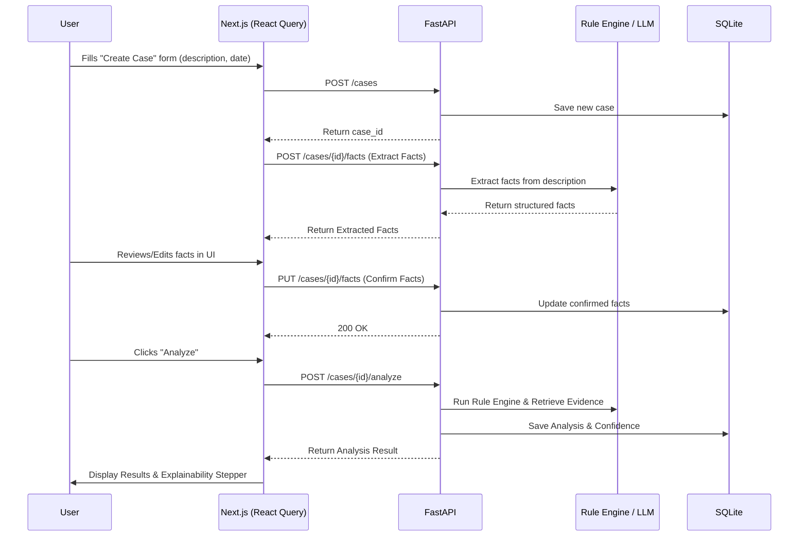

# IP-SAKTI Sahayak — Technical Architecture & Integration Plan

This document serves as the single source of truth for the engineering team, bridging the frontend and backend implementations. 

---

## 1. Tech Stack Overview

### Frontend (User Interface & State)
* **Framework:** Next.js (App Router)
* **Styling & Components:** Tailwind CSS + shadcn/ui (radix-ui)
* **Data Fetching & State:** React Query (TanStack Query) + Axios
* **Icons:** Lucide React

### Backend (API & AI Logic)
* **Framework:** FastAPI (Python)
* **Database:** SQLite
* **AI/RAG:** LangChain / LlamaIndex + ChromaDB (as per spec)

---

## 2. Repository Folder Division (Monorepo)

Both teams will work out of a single GitHub repository to ensure API contracts and features stay in sync.

```text
IP-SAKTI-Sahayak/
│
├── frontend/                 # NEXT.JS APPLICATION (Frontend Team)
│   ├── src/
│   │   ├── app/              # Next.js App Router (Pages & Layouts)
│   │   │   ├── dashboard/    # Screen 1: Dashboard
│   │   │   ├── cases/
│   │   │   │   ├── new/      # Screen 2: Create Case
│   │   │   │   ├── [id]/     # Screens 3 & 4 & 5: Analysis & Explainability
│   │   ├── components/       # Reusable UI (shadcn/ui goes here)
│   │   │   ├── ui/           # Base shadcn components (buttons, cards, etc)
│   │   │   ├── domain/       # IP-Sakti specific components (ExplainabilityStepper, FactList)
│   │   ├── lib/              # Utility functions, API clients
│   │   │   ├── api.ts        # Axios instance configured for FastAPI
│   │   ├── hooks/            # Custom React Hooks
│   │   │   ├── queries/      # React Query definitions (useCase, useAnalyze)
│   │   ├── types/            # TypeScript interfaces matching backend models
│
├── backend/                  # FASTAPI APPLICATION (Backend Team)
│   ├── app/
│   │   ├── api/              # FastAPI routers (endpoints)
│   │   ├── core/             # Config, security, DB connections
│   │   ├── models/           # SQLAlchemy/SQLModel schemas
│   │   ├── schemas/          # Pydantic models (for request/response)
│   │   ├── services/         # Business logic, Rule Engine, RAG integration
│
├── docs/                     # Project specs, flowcharts
├── README.md                 # Setup instructions for both teams
└── docker-compose.yml        # (Optional) For spinning up both easily
```

---

## 3. Data Flow & Flowcharts

The following Mermaid diagram shows how the Next.js frontend interacts with the FastAPI backend using React Query.

### System Flowchart



---

## 4. Frontend Route Mapping to Backend APIs

This section is critical for the backend team. The frontend expects these exact endpoints to exist in FastAPI.

| Next.js Route (Frontend) | Screen | FastAPI Endpoint Required (Backend) | React Query Action |
| :--- | :--- | :--- | :--- |
| `/dashboard` | 1. Dashboard | `GET /cases` | `useQuery(['cases'])` |
| `/cases/new` | 2. Create Case | `POST /cases` | `useMutation(createCase)` |
| `/cases/[id]/verify` | 3. Fact Verification | `POST /cases/{id}/facts` | `useMutation(extractOrUpdateFacts)` |
| `/cases/[id]` | 4. Analysis Result | `POST /cases/{id}/analyze` | `useMutation(runAnalysis)` |
| `/cases/[id]/explain` | 5. Explainability | `GET /cases/{id}/explain` | `useQuery(['explain', id])` |
| (Download Action) | 6. Case Report | `GET /cases/{id}/report` | Standard Axios Download |

---

## 5. Technical Contracts (For Backend Team)

To ensure the frontend doesn't break, the backend **must** return data in consistent JSON schemas. 

### A. Confidence Object
The frontend will color-code based on the `band`. Backend must provide exactly this:
```json
{
  "fact_conf": 0.85,
  "rule_fit_conf": 1.0,
  "evidence_conf": 0.9,
  "citation_conf": 0.8,
  "overall_conf": 0.8,
  "band": "HIGH" // HIGH, MEDIUM, LOW, INSUFFICIENT
}
```

### B. Explainability Trace Object
The frontend `ExplainabilityStepper` component will map over this exact array.
```json
{
  "steps": [
    {
      "title": "Extracted Facts",
      "status": "success",
      "details": "Found 4 facts with 85% confidence."
    },
    {
      "title": "Rules Triggered",
      "status": "success",
      "details": "Triggered R-3P-02 based on dosage modification."
    }
    // ... continues for citations, evidence, etc.
  ]
}
```
